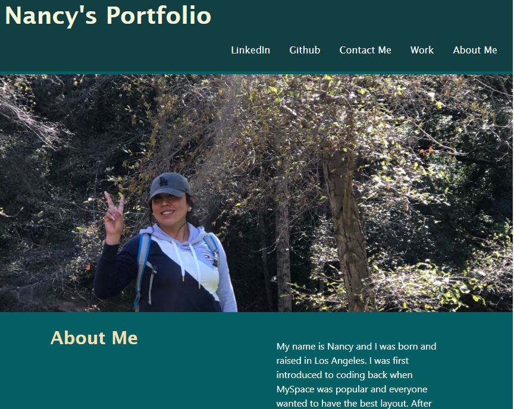

# personalCSS
 

## Description
For this assignment I will create a web page that will serve as my portfolio page. In building this web application I will help to showcase skills and what I have learned so far. I will be able to direct any potential employers. My porfolio will allow me to effectievly  show what my strong areas are as well as any deployed web applications. In building this web application I will put to use what I have learned so far in this course.

## User Story
If an Employer goes to my web application and wants to see my skills they can view my web application as an example. If they want to see more, work samples will be on my porfolio. This will hopefully convince them that I am a good candidate for potential openings.

## Acceptance Criteria
- Portfolio loads and sample work loads sucessfully. 
- Developers name and photo or avatar loads. 
- When links to sections about me or work loads and links work well, links should take you to correct section.
- When clicking on images of work and they are successfully linked to work. Web page should be easy to use.

## Tools and Technologies
- CSS
- HTML
- Flexbox

## MockUp
> **To view my application**: visit deployed [Link](https://marissanancy.github.io/personalCSS/)

The following is what the web page should look like:
